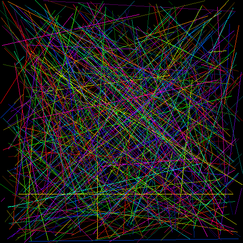

## Programs 1 and 2 (Line-Scan Conversion)

## Submit the following: 
1. Source code(s) found here [../p1_2_line_drawing](../p1_2_line_drawing)

2. A video demonstration that you can draw positive slopes, negative slopes, horizontal and vertical lines.  

a) A video demonstation can be found here[./output/p1-2-video.mov](./output/p1-2-video.mov)

b) Show an image that demonstrates various line types\

c) Show lines that compose a square

3. Report showing timing chart and algorithm comparison shown in the pdf: [1-2.pdf](./1-2.pdf)
