## Program 3 (Geometric Transformations)

## Submit the following:

## 1. Submit your source code (only the file with your source code)
Note: I built ```Displaypixels(datalines, num)``` it can be called using ```viz.draw(datelines)``` with more relevant functionality. 

## 2. Submit a video or several screenshots of:

a) Input lines from a separated file (e.g. a txt file) and display it \
Input lines from ```./input/line.txt```: (80 50 150 200), (100 300 300 300) \

a0) Apply a Scale (2, 1, 10, 10) --> Display the result. Green line is the original, pink line is after it has been scaled. I showed two lines for validation.
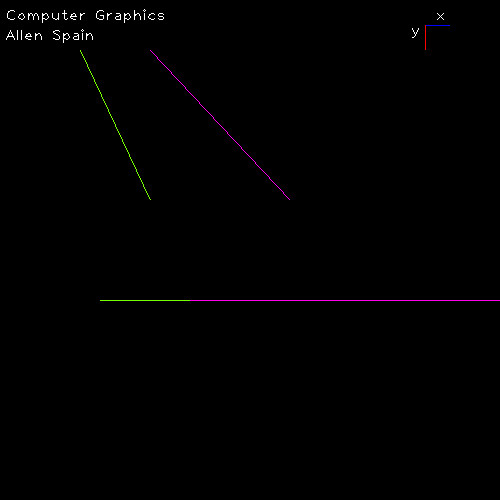

a1) After you apply the scale, apply a Rotate (30°, 10, 10) --> Display the result. Green line is the original, pink line is after it has been scaled and rotated.\
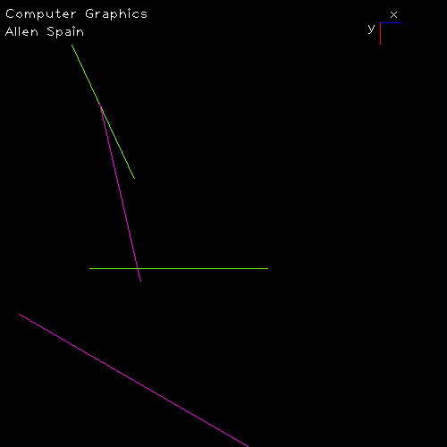

b) Generate a file that contains your final result Input what you just generate and display it. Output lines from ```./output/data.txt``` 

b0) Text file of generated text file \
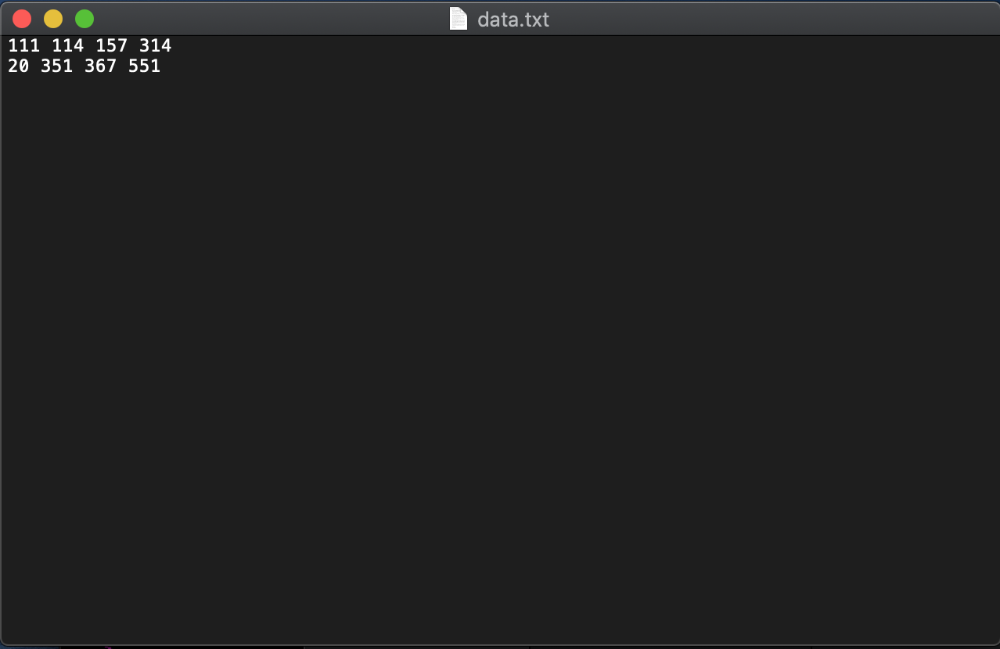 

b1) Image generated after using file from text file in b0. Only shows output lines that were pink in a1) the transformation only is shown below\
Before writting: \
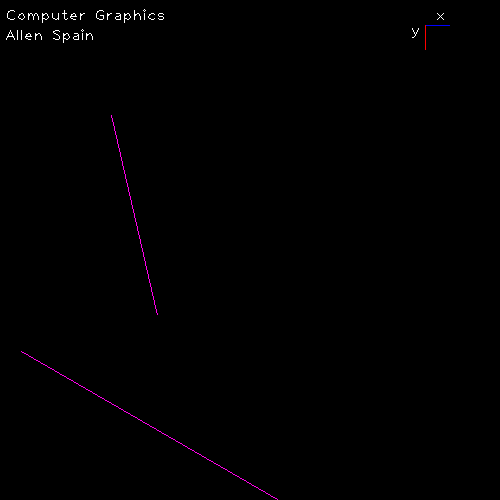
After reading from file in b0) \
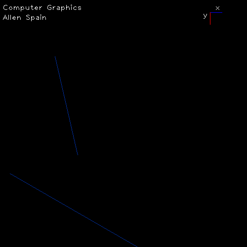

## 3. Some other intesting examples 
All original lines are drawn in green, those after transformation are in pink. \
a) triangle scaled by 2 in x and y and transformed about the original traingles center\
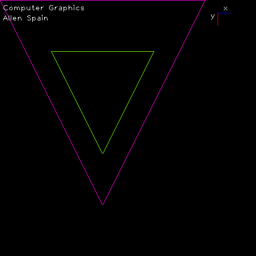
b) rotation \

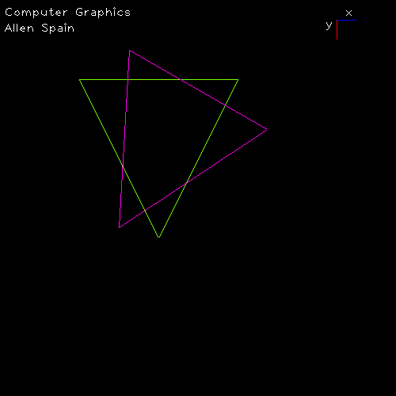
c) Rotate from in increments of 5 \

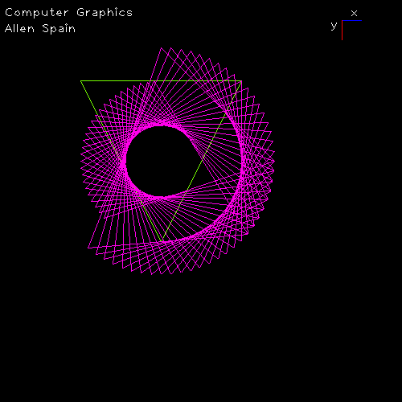
b) Cube, guessing centriod (Original cube near origin) scale without translation\

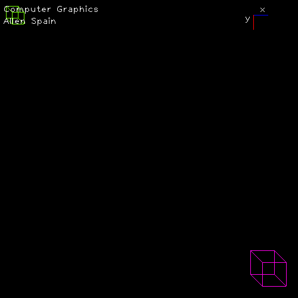
e) Scale with translation\

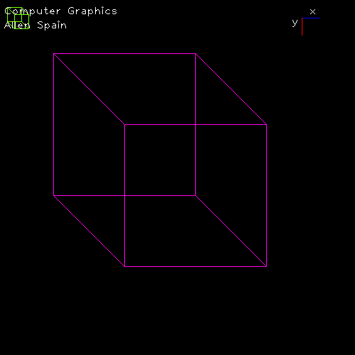
f) Rotate after translation and scale, with updated and original cube.\

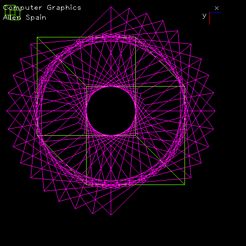
g) Just because it looks cool. The video file can be found here [./output/ps3-cube-4.mov](./output/ps3-cube-4.mov)\

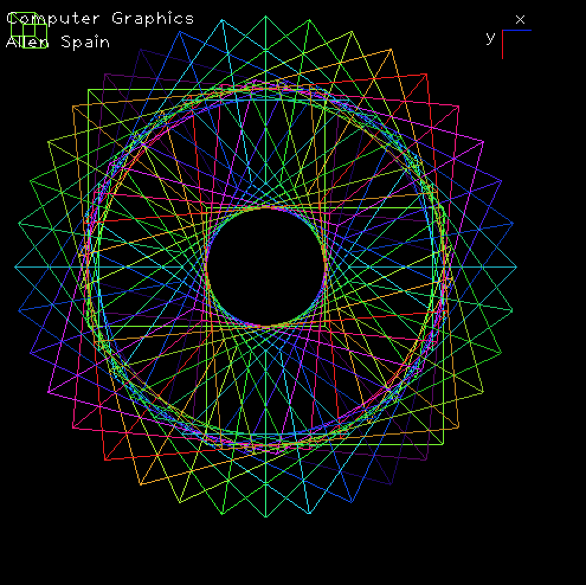
