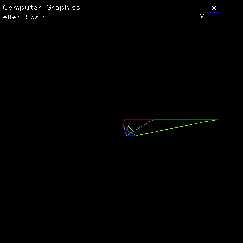

# Program 4 (Perspective Projection)
## CSCI 6810
## Allen Spain

#### Notes 

### 1. Cube
a0) Cube projected using default projection parameters


### 2. Cube
a0) House projected using defualt projection parameters. Note that becuase the origin of my coordinate system is in the top right rather than in the bottom left the "roof" is on the bottom. The visual cone isn't very good the original image is very distorted.


### 3. Basic Scale 
#### a0) Scale ```(1,2,1)```


#### b0) Scale ```(2,1,1)```


#### c0) Scale ```(1,1,2)``` this mode pushes the shape further away from view


#### 4. Basic Rotate
#### a0) Rz(20)


#### b0) Ry(20)


#### c0) Rx(20)


#### c1) Rz(40)


#### c2) Rz(90)


#### c3) Rz(180)


#### c4) Rz(360)


#### 5. Translation
#### a0) (50, 50, 50)


#### b0) (10, 10, 100)


#### c0) (-100,-100,-2)

